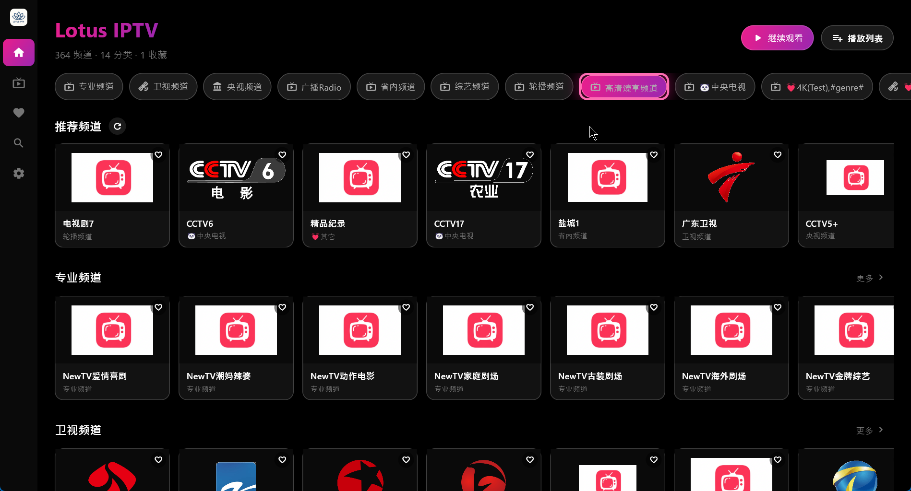
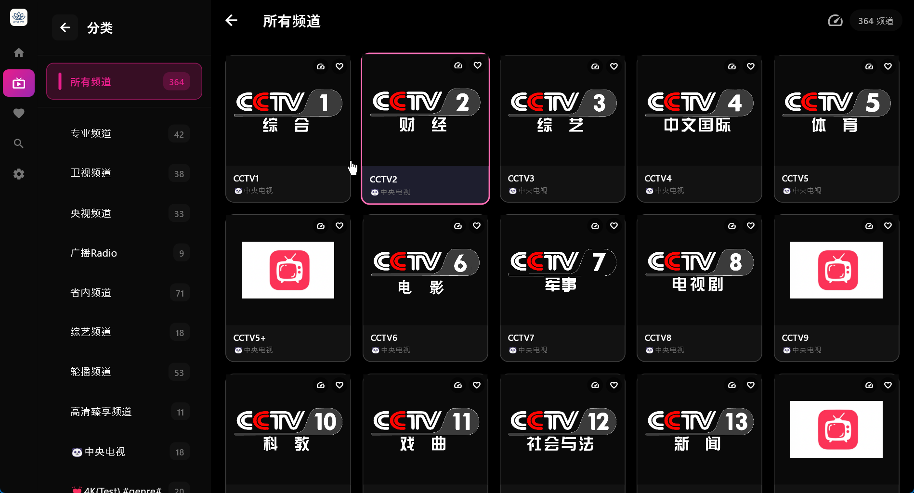

# Lotus IPTV

<p align="center">
  
</p>

<p align="center">
  <strong>现代化 IPTV 播放器 - 支持 Windows、Android 和 Android TV</strong>
</p>

<p align="center">
  <a href="https://github.com/shnulaa/FlutterIPTV/actions/workflows/build-release.yml">
    
  </a>
  <a href="https://github.com/shnulaa/FlutterIPTV/releases">
    
  </a>
</p>

<p align="center">
  <a href="README.md">English</a> | <strong>中文</strong>
</p>

Lotus IPTV 是一款基于 Flutter 开发的现代化高性能 IPTV 播放器。采用精美的莲花主题 UI，粉紫渐变色调，针对桌面、移动端和电视平台进行了深度优化。

## ✨ 功能特性

### 🎨 莲花主题 UI
- 纯黑背景搭配莲花粉紫渐变色调
- 玻璃拟态风格卡片（桌面/移动端）
- TV 端专属优化界面，无动画确保流畅性能
- 自动折叠侧边栏导航（获得焦点时展开）

### 📺 多平台支持
- **Windows**: 桌面优化 UI，支持键盘快捷键
- **Android 手机**: 触摸友好界面
- **Android TV**: 完整 D-Pad 导航，遥控器全面支持

### ⚡ 高性能播放
- **桌面/移动端**: 基于 `media_kit` 硬件加速
- **Android TV**: 原生 ExoPlayer (Media3) 支持 4K 视频播放
- 实时视频参数显示（分辨率、帧率、编解码器信息）
- 支持 HLS (m3u8)、MP4、MKV 等多种格式

### 📂 智能播放列表管理
- 支持从本地文件或 URL 导入 M3U 播放列表
- 二维码导入，方便手机到电视的快速传输
- 根据 `group-title` 自动分组
- 频道可用性检测，支持批量操作
- 将不可用频道移至单独分类

### ❤️ 用户功能
- 收藏管理（TV 端长按 OK 键，移动端点击按钮）
- 频道搜索
- 推荐频道（点击刷新随机更换）
- 缺失台标时显示默认图标

## 📸 软件截图

<p align="center">
  
  
  
</p>

## 🚀 安装指南

从 [Releases 页面](https://github.com/shnulaa/FlutterIPTV/releases) 下载最新版本。

### Android / Android TV
```bash
# 通过 ADB 安装
adb install flutter_iptv-android-arm64-vX.X.X.apk
```

### Windows
1. 下载并解压 `flutter_iptv-windows-vX.X.X.zip`
2. 运行 `flutter_iptv.exe`

## 🎮 操作控制

| 动作 | 键盘 | 电视遥控器 |
|--------|----------|-----------|
| 播放/暂停 | 空格/回车 | 确认键 |
| 上一频道 | ↑ | D-Pad 上 |
| 下一频道 | ↓ | D-Pad 下 |
| 快进 | → | D-Pad 右 |
| 快退 | ← | D-Pad 左 |
| 收藏 (TV) | - | 长按确认键 |
| 静音 | M | - |
| 返回 | Esc | 返回键 |

## 🛠️ 开发构建

### 环境要求
- Flutter SDK (>=3.0.0)
- Android Studio（用于 Android/TV 构建）
- Visual Studio（用于 Windows 构建）

### 构建步骤
```bash
git clone https://github.com/shnulaa/FlutterIPTV.git
cd FlutterIPTV
flutter pub get

# 运行
flutter run -d windows
flutter run -d <android_device>

# 构建发布版
flutter build windows
flutter build apk --release
```

## 🤝 参与贡献

欢迎提交 Pull Request！

## ⚠️ 免责声明

本应用程序仅作为播放器，不提供任何内容。用户需自行提供 M3U 播放列表。开发者不对通过本应用播放的内容承担任何责任。
